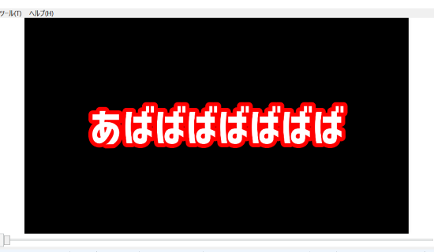
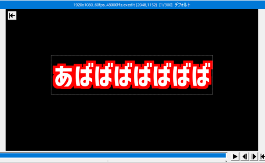

# f2ft
YMM4から出力されるexoファイルの縁取りエフェクトをAviUtlスクリプトの縁取りTに置換するプログラム 
YMM4のプレビューでは綺麗なのにAviUtlだとカクカクなのやだよね。じゃあ変換しようね。って色々やってたらなんかできた。 

# 使い方
YouTubeにて使い方動画を投稿しました。こちらをご参照ください。
https://www.youtube.com/watch?v=rZOl-fhr1J8
