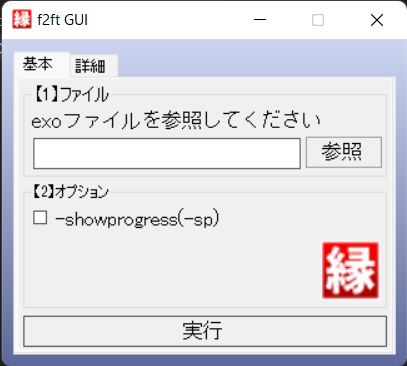

# f2ft
YMM4から出力されるexoファイルの縁取りエフェクトをAviUtlスクリプトの縁取りTに置換するプログラム 
YMM4のプレビューでは綺麗なのにAviUtlだとカクカクなのやだよね。じゃあ変換しようね。って色々やってたらなんかできた。 

# 使い方
一番簡単な使い方はf2ft.exeにYMM4から出力されたexoファイルをD&Dする方法です。 
※f2ftはYMM4の設定→全般→外部連携→「AviUtl標準の縁取りエフェクトを使用する」が**有効**の状態で出力されたexoファイルしか処理できません。ご注意ください。 
  

## f2ftgui.exeとは?
今の所殆ど使う意味はありません。f2ftの操作をウィンドウで出来るくらいです。 
オプションの-showprogressはf2ftが実行してる際に途中経過を表示します。ただ文字の表示は多少なりとも時間がかかり、処理の終了が少し遅くなります。 
 

## 処理が終わったexoファイルはどこに出る?
処理が終わったexoファイルは処理前のexoファイルと同じフォルダ内に作られます。処理前のexoファイル自体は操作していないのでバックアップ代わりにもなります。

# メモ
いずれはオプションで縁取りTの高精度を有効に出来るようにしたい。
